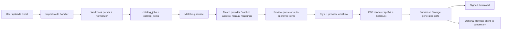

# Promo Catalog Studio Solution Design

## 1. High-level architecture

Promo Catalog Studio is designed as a server-led internal workflow app:

- Next.js App Router provides the authenticated UI, route handlers, and server actions.
- Supabase Auth handles sign-in and session-backed access control.
- Supabase Postgres stores jobs, items, match candidates, templates, assets, mappings, generated files, and flipbook metadata.
- Supabase Storage stores uploaded workbooks, cached assets, manual uploads, and generated PDFs.
- A catalog service layer in `src/lib/catalog` owns import, matching, storage paths, PDF rendering, and flipbook logic.
- PDF rendering is done with `pdfkit` on the server to keep A4 layout deterministic on Vercel and avoid browser screenshot drift.



## 2. System flow

### End-to-end job flow

1. User logs in through Supabase Auth.
2. User creates a new catalog job on `/catalogs/new`.
3. The upload route stores the raw `.xlsx` file in `raw-uploads`.
4. The import service parses the workbook, detects columns, validates required data, and normalizes rows.
5. `catalog_jobs` and `catalog_items` are created.
6. The matching service checks manual mappings first, cached assets second, then Makro search by SKU and product name.
7. High-confidence results are auto-approved. Medium and low confidence results are stored as candidates and sent to manual review.
8. Users review flagged items, approve candidates, run keyword re-search, or upload manual images.
9. Users configure template toggles and reorder/hide products in preview.
10. The generation route renders a deterministic A4 PDF and stores it in `generated-pdfs`.
11. The result page exposes signed download links and the flipbook step.
12. If enabled and configured, Heyzine conversion runs via `client_id`. Otherwise the workflow remains manual and PDF-first.

### Job statuses

- `draft`
- `uploaded`
- `parsing`
- `matching`
- `needs_review`
- `ready_to_generate`
- `generating_pdf`
- `pdf_ready`
- `converting_flipbook`
- `completed`
- `failed`
- `cancelled`

### Item statuses

- `pending`
- `matched`
- `needs_review`
- `approved`
- `rejected`
- `rendered`

## 3. Design decisions and rationale

### PDF-first, not flipbook-first

The PDF is the durable business output. Flipbooks are treated as a downstream publishing step because:

- PDF generation is required regardless of third-party availability.
- internal teams can still deliver catalogs even when flipbook APIs are unavailable
- manual Heyzine upload is an acceptable fallback for promotional publishing

### Server-rendered PDFs with `pdfkit`

This project avoids screenshot-based rendering because deterministic business print output matters more than HTML fidelity. `pdfkit` gives:

- exact A4 sizing
- exact 3x3 card placement
- stable pagination
- predictable Thai text embedding through Sarabun fonts
- Vercel-friendly Node execution

### Matching pipeline is confidence-based and override-first

Manual decisions should always win. The implemented order is:

1. saved manual mapping by normalized SKU
2. cached product assets in Supabase
3. Makro search by SKU
4. Makro search by product name fallback
5. review queue if confidence is below auto-approval threshold

### Storage uses traceable paths

Storage keys encode user/job/item context to keep files auditable and cleanup-friendly:

- raw uploads: `raw-uploads/{userId}/{jobId}/{timestamp}-{filename}`
- PDFs: `generated-pdfs/{userId}/{jobId}/catalog-v{n}.pdf`
- manual assets: `manual-assets/{userId}/{jobId}/{itemId}/{uuid}-{filename}`
- Makro cache: `asset-cache/makro/{asset-key}/{filename}`

## 4. Folder structure

```text
src/
  app/
    (app)/
      dashboard/
      catalogs/
        new/
        [jobId]/mapping/
        [jobId]/review/
        [jobId]/settings/
        [jobId]/preview/
        [jobId]/generate/
        [jobId]/result/
      library/
      settings/
    api/
      jobs/import
      jobs/[jobId]/generate-pdf
      jobs/[jobId]/flipbook
      items/[itemId]/search
      items/[itemId]/upload
      files/[fileId]/download
    login/
  components/
    catalog/
    layout/
    ui/
  lib/
    catalog/
      excel.ts
      repository.ts
      storage.ts
      matching/
      pdf/
      flipbooks/
    supabase/
```

## 5. Data flow

### Import data flow

- Browser form POSTs multipart data to `/api/jobs/import`
- Route validates auth and upload payload
- Repository stores the workbook in Supabase Storage
- Excel parser reads the first sheet, detects headers, normalizes rows, and computes discount values
- Repository writes `catalog_jobs`, `catalog_items`, and `generated_files(raw_upload)`
- Matching service enriches items and updates job counts/status

### Review data flow

- Review page loads `CatalogJobBundle`
- Bundle includes items, selected asset, ranked candidates, files, events, and flipbook state
- User actions call server actions or route handlers to approve candidates, upload custom images, or save mappings

### Generation data flow

- Generate route loads the full job bundle
- Product asset buffers are resolved server-side
- PDF renderer chunks items into groups of 9 and draws cards in a 3x3 A4 grid
- PDF binary is stored in Supabase Storage and recorded in `generated_files`
- Job page count/status is updated
- Optional Heyzine conversion is triggered only when the job is in `client_id` mode and config exists

## 6. Database schema

The full runnable schema lives in [`supabase/migrations/202603160001_initial_schema.sql`](/C:/Users/Teera/OneDrive/Documents/New%20project/supabase/migrations/202603160001_initial_schema.sql).

### Core tables

- `profiles`: app roles and user profile metadata tied to `auth.users`
- `catalog_templates`: reusable template definitions and theme JSON
- `catalog_jobs`: one row per catalog workflow run
- `catalog_items`: normalized product rows imported from Excel
- `product_assets`: Makro, manual, or cached asset metadata
- `product_match_candidates`: ranked asset candidates per catalog item
- `manual_mappings`: reusable human-approved SKU-to-asset overrides
- `generated_files`: raw uploads, PDFs, and derived artifacts
- `flipbooks`: downstream publishing metadata
- `catalog_job_events`: operational timeline for the generation status screen

### Key constraints and indexes

- enum types for roles, job statuses, item statuses, asset sources, flipbook modes, and file types
- unique `(job_id, row_no)` on `catalog_items`
- unique `(item_id, asset_id)` and `(item_id, rank_no)` on `product_match_candidates`
- unique `normalized_sku` on `manual_mappings`
- unique `(job_id, provider)` on `flipbooks`
- search and workflow indexes on job status, owner, normalized SKU/name, display order, and candidate rank

### RLS model

All business tables have RLS enabled.

- normal users can only access jobs they created
- admins can access all records via `public.is_admin()`
- row ownership checks cascade through job relationships for items, files, flipbooks, and events

### Storage strategy

Buckets created in the migration:

- `raw-uploads`
- `asset-cache`
- `generated-pdfs`
- `manual-assets`

Access strategy:

- user-facing buckets use folder-based ownership with `auth.uid()` in the first path segment
- `asset-cache` is intended for service-role-managed cache writes and signed server access
- generated PDFs are served via signed links, not public URLs

## 7. Supabase implementation notes

### Auth

- Supabase SSR helpers are used in server components and middleware
- the shared `requireUser()` helper gates authenticated screens
- profiles support `admin`, `manager`, and `operator`

### Storage

- service-role access is used for background-style operations such as cache writes, manual asset attachment, file signing, and PDF persistence
- client/browser flows stay simple and post back to Next.js routes instead of writing directly to Storage

### Local development

- create a Supabase project
- apply the SQL migration
- set env vars in `.env.local`
- seed at least one auth user, then create a matching `profiles` row if your auth hook does not do that automatically

## 8. Route and API design

### Screens

- `/login`: secure email/password entry
- `/dashboard`: recent jobs, status metrics, template shortcuts
- `/catalogs/new`: upload form, template selection, flipbook mode, mapping reuse toggle
- `/catalogs/[jobId]/mapping`: import summary, detected column mapping, validation preview
- `/catalogs/[jobId]/review`: candidate approval, manual search, custom image upload
- `/catalogs/[jobId]/settings`: variant and pricing metadata toggles with live card preview
- `/catalogs/[jobId]/preview`: reorder, rename, hide/show, A4 grid preview
- `/catalogs/[jobId]/generate`: generation timeline and trigger step
- `/catalogs/[jobId]/result`: signed PDF download, flipbook step, duplicate job
- `/library`: asset and manual mapping lookup
- `/settings`: environment and workflow diagnostics

### API routes

- `POST /api/jobs/import`
- `POST /api/jobs/[jobId]/generate-pdf`
- `POST /api/jobs/[jobId]/flipbook`
- `GET /api/items/[itemId]/search?q=...`
- `POST /api/items/[itemId]/upload`
- `GET /api/files/[fileId]/download`

### Server actions

Server actions are used for small authenticated mutations:

- approve candidate
- save display name
- move item up/down
- toggle item visibility
- save style options
- duplicate job

## 9. UI/UX structure

### Dashboard

Responsibilities:

- show workload at a glance
- help users resume review-heavy jobs quickly
- expose a clear entry into new job creation

Important states:

- empty state when no jobs exist
- review-heavy state with `needs_review` prominence
- ready/export state pointing straight to preview/result

### New catalog and mapping

Responsibilities:

- make upload confidence high
- validate file structure before deeper processing
- surface detected columns and sample rows

Important states:

- invalid file
- missing SKU
- missing price columns
- workbook with no importable rows

### Matching review

Responsibilities:

- present the current suggestion
- show alternative candidates with confidence
- allow keyword re-search
- allow custom image upload
- allow saving reusable manual mapping

Important states:

- no candidates found
- low-confidence suggestion
- custom asset uploaded successfully
- manual mapping saved and reused in future imports

### Settings and preview

Responsibilities:

- separate style decisions from source data decisions
- help users verify commercial hierarchy before export
- support fast campaign tweaks without re-importing

Important states:

- promo variant
- clean variant
- hidden products
- renamed display labels

### Generation and result

Responsibilities:

- make background-like steps visible
- show event logs and failure messages clearly
- keep the PDF download action obvious

Important states:

- generating
- failed with retry path
- PDF ready
- manual flipbook mode
- client-driven flipbook created

## 10. Catalog card rendering rules

Implemented rendering behavior:

- A4 canvas, 3 columns x 3 rows, 9 products per page
- image area is dominant and uses `contain`
- promo price is primary when `promo_price < normal_price`
- normal price is smaller and struck through when a real promo exists
- discount amount is preferred over percent by default
- product name is truncated to a stable two-line area
- metadata row is reserved for SKU, pack size, and unit

## 11. Matching and scoring logic

The scoring service currently uses:

- exact normalized SKU equality: strongest weight
- partial normalized SKU containment: high weight
- tokenized product name overlap: medium weight
- pack-size hint inside asset name: small additional weight

Decision thresholds are defined in `src/lib/catalog/constants.ts` and used as:

- high confidence: auto-approve
- medium confidence: queue for review with a leading suggestion
- low confidence: review required with weak or empty candidate set

Override precedence:

1. manual mapping
2. manually selected/uploaded asset
3. auto-match result

## 12. PDF generation architecture

### Why this approach

- works in Vercel Node runtime
- avoids headless browser layout differences
- supports embedded Thai fonts cleanly
- keeps pagination predictable for print

### Rendering pipeline

1. Load job bundle and visible items.
2. Resolve storage/image buffers server-side.
3. Chunk items into pages of 9.
4. Draw background, page heading, and 9 cards with fixed dimensions.
5. Persist the PDF in `generated-pdfs`.
6. Save file metadata and update job page count/status.

### Key renderer files

- [`src/lib/catalog/pdf/renderer.ts`](/C:/Users/Teera/OneDrive/Documents/New%20project/src/lib/catalog/pdf/renderer.ts)
- [`src/lib/catalog/pdf/fonts.ts`](/C:/Users/Teera/OneDrive/Documents/New%20project/src/lib/catalog/pdf/fonts.ts)

## 13. Flipbook-ready approach

### Current product position

The app is intentionally valuable without API-driven flipbook creation:

- manual upload remains the default business-safe workflow
- result pages still store flipbook state and links when available
- optional API conversion is isolated in one service module

### Heyzine integration assumption

Verified against Heyzine's developer documentation:

- the `/rest` conversion flow accepts a `client_id` and a public PDF URL
- account-management and other secured operations require an API key
- this implementation only uses the documented conversion flow and does not assume unsupported management endpoints

Relevant implementation file:

- [`src/lib/catalog/flipbooks/heyzine.ts`](/C:/Users/Teera/OneDrive/Documents/New%20project/src/lib/catalog/flipbooks/heyzine.ts)

## 14. Error handling model

Handled failure classes include:

- invalid workbook or missing sheet
- missing required columns
- bad numeric price parsing
- external match fetch failure
- no image found
- PDF generation failure
- storage upload/signing failure
- Heyzine conversion unavailable or not configured

Design principle:

- fail the current step
- preserve job data
- record a human-readable message on the job
- keep users moving with manual fallbacks where possible

## 15. Implementation plan for the next hardening pass

The current codebase is a strong production-oriented foundation. The most valuable next steps are:

1. Replace best-effort Makro scraping with a contracted feed, stable internal crawler, or approved catalog image source.
2. Add background job execution for matching and PDF generation if very large catalogs become common.
3. Add richer column-mapping UI with editable header remapping before import commit.
4. Add automated test coverage for workbook parsing, scoring thresholds, and PDF page math.
5. Add admin tooling for template CRUD and mapping governance.
